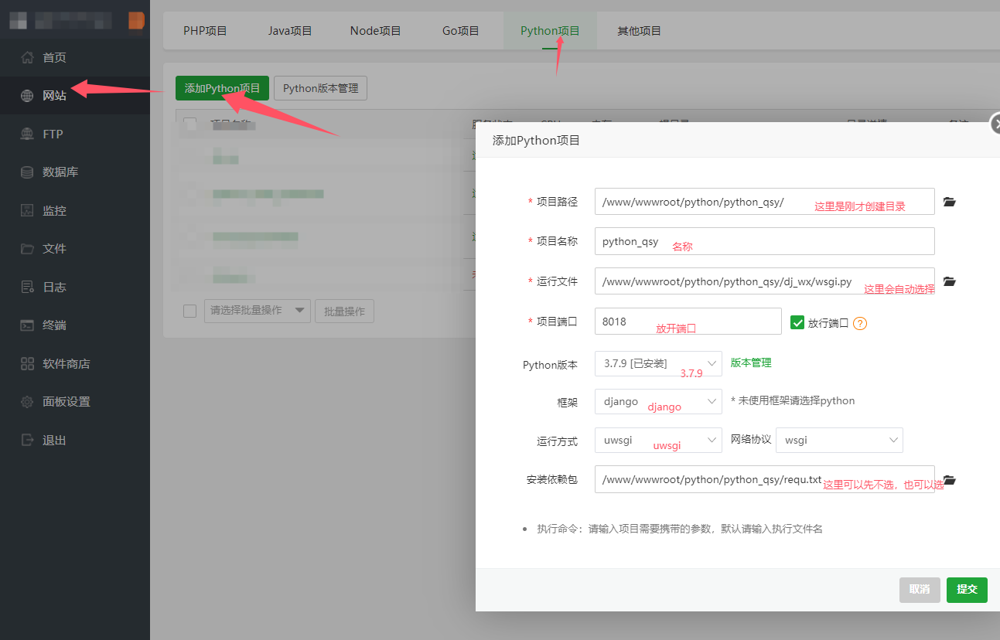
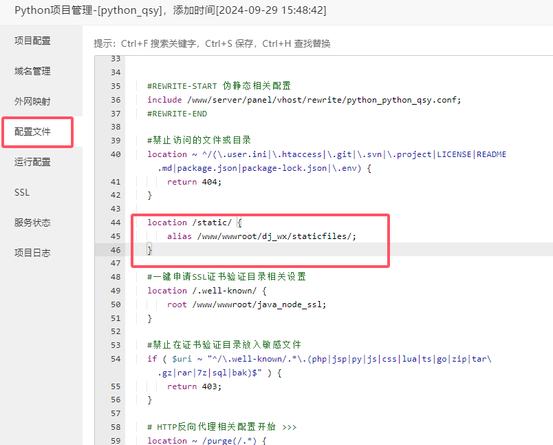
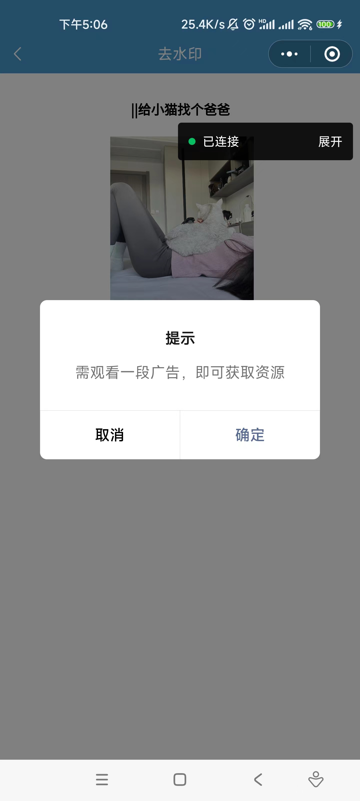

2024最新微信去水印小程序源码（前端微信小程序后端python的django框架）
抖音去水印、快手去水印、微视去水印、头条去水印、火山去水印、小红书去水印


如果有接口可以用自己接口，如果没有去水印接口，可以使用我的，如果用我的接口小程序有问题可以咨询我

python_kk，有问题可以询问，免费解答，后期抽时间教大家流量应该咋来，怎么获取流量


搭建流程：

1、准备一个备案域名，这里以（test.aketest.site为例），域名和服务器最好都在京东云或者阿里云买，不然你的服务器买了，域名就算其他备案了，京东还要备案


2、一个2核2G轻量云服务器即可

https://3.cn/25K8Z-qW

推荐直接入手3年这个，3年也就392


3、把备案域名解析到云服务器


4、服务器安装宝塔（复制到命令行一键安装）

```bash
url=https://download.bt.cn/install/install_lts.sh;if [ -f /usr/bin/curl ];then curl -sSO $url;else wget -O install_lts.sh $url;fi;bash install_lts.sh ed8484bec
```


5、提前找到一个目录，把后端代码上传，看好目录层次，不要错了


6、安装python版本3.7.9这个版本不要错了


7、云服务器开启安全组，开一下端口，我这里用 8018 你们根据自己需要开放端口


8、添加后端项目，必须按照图片里的写好




9、我们设置一下网站https访问


如果证书验证失败，就使用dns验证


设置django转发静态文件给nginx




10、设置一下数据库


11、更新django文件数据库，你们也可以在开始的时候就把数据库换了，再上传


12、迁移数据库

python3 manage.py makemigrations

python3 manage.py migrate


设置超级管理员


13、重启python项目，如果失败就多重启几次，再失败可能是有些依赖没有装上，看日志


14、访问后台https://test.aketest.site/admin

我自己小程序在用去水印接口平台

 https://api.ake999.com

主流平台都可以解析，非常稳定，大家自己选择


这里你有几个小程序就设置几个，这里是可以批量给小程序设置去水印接口


下面开始微信小程序，微信小程序这里要操作的就很简单了

1、直接用微信开发者工具打开即可


2、搜索全部 https://test.aketest.site 替换成 你的域名


3、https://test.aketest.site添加微信小程序后台request和download安全域名

这个文件下所有域名加download安全域名


4、测试下载





